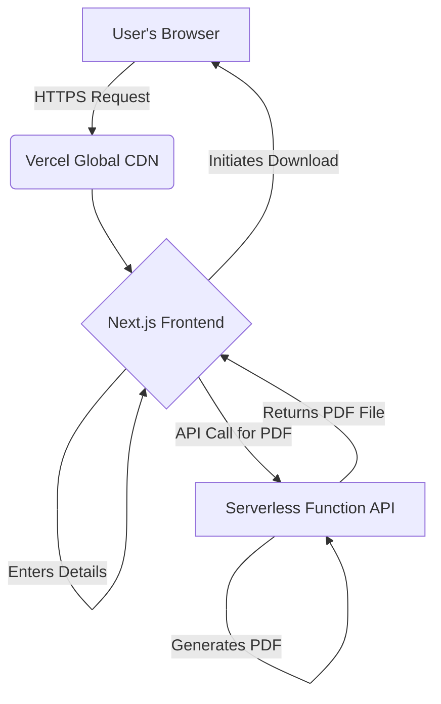
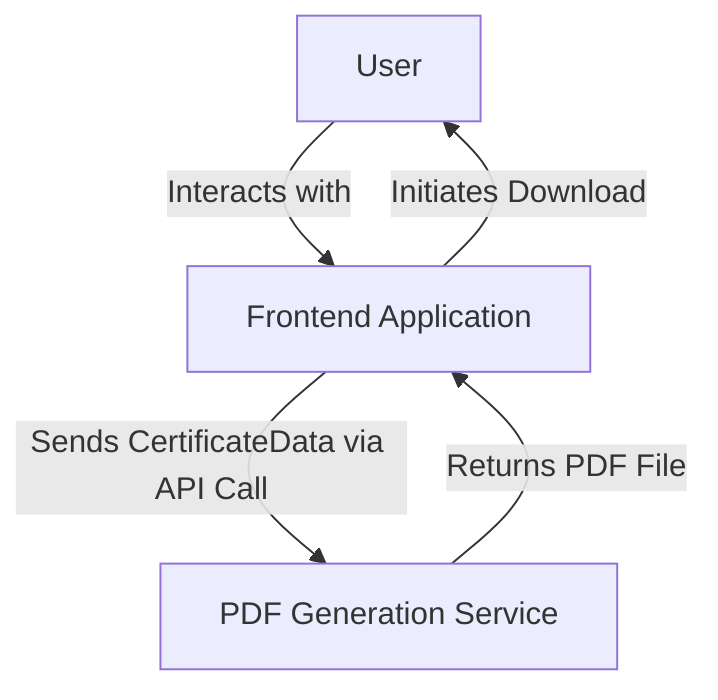

# July Juddah Certificate Portal Fullstack Architecture Document

This document outlines the complete fullstack architecture for the July Juddah Certificate Portal (V1.0), including the frontend implementation, the serverless backend for PDF generation, and their integration. It serves as the single source of truth for AI-driven development, ensuring consistency across the entire technology stack.

| Date | Version | Description | Author |
| :--- | :--- | :--- | :--- |
| July 27, 2025 | 1.0 | Initial architecture draft. | Winston, Architect |

### Starter Template or Existing Project

To accelerate setup and ensure we follow best practices, we will use the official `create-next-app` starter template. This provides a production-ready foundation that includes the framework, build tooling, and project structure needed for both the frontend application and the serverless function.

-----

## High Level Architecture

#### Technical Summary

The architecture for this project will follow a modern Jamstack approach, prioritizing performance, scalability, and cost-effectiveness. The system consists of a frontend application built with Next.js, which will be served statically via a global CDN. All backend logic, specifically the PDF generation, will be handled by an on-demand, serverless function. The entire project will be organized in a monorepo to streamline development and prepare for the backend services required in V2.0. This architecture directly supports the V1.0 goal of providing a fast, reliable, and globally accessible certificate generation experience.

#### Platform and Infrastructure Choice

  * **Platform:** **Vercel**.
  * **Rationale:** As the creators of Next.js, Vercel provides a seamless, zero-configuration deployment and hosting platform. It automatically handles the build process, deployment of the serverless function, and serving of the frontend via its global edge CDN. This is the most pragmatic and efficient choice for this project.
  * **Key Services:**
      * Vercel Next.js Hosting
      * Vercel Serverless Functions
      * Vercel Global CDN

#### Repository Structure

  * **Structure:** **Monorepo**.
  * **Rationale:** This structure was established in the PRD's technical assumptions. It allows us to manage the V1 frontend and serverless function in a single repository, and will easily accommodate the additional backend services for V2.0.

#### High Level Architecture Diagram



#### Architectural Patterns

  * **Jamstack Architecture:** We will use a modern JavaScript framework (Next.js) with backend logic provided by serverless functions.
      * *Rationale:* This pattern provides exceptional performance, high security, and low operational overhead.
  * **Component-Based UI:** The frontend will be built as a collection of reusable components.
      * *Rationale:* This is a standard practice for modern frameworks like Next.js and ensures a maintainable and scalable user interface.
  * **Serverless Functions:** All backend logic will be encapsulated in on-demand functions.
      * *Rationale:* This is highly cost-effective and automatically scales to meet the sharp, temporary increase in traffic expected after the event.

-----

## Tech Stack

This table is the single source of truth for all technologies, libraries, and tools to be used.

| Category | Technology | Version | Purpose | Rationale |
| :--- | :--- | :--- | :--- | :--- |
| **Frontend Language** | TypeScript | 5.4.5 | For type-safe frontend code. | Industry standard for robust React/Next.js applications. |
| **Frontend Framework** | Next.js | 14.2.3 | The core React framework for the UI and serverless functions. | Provides a production-ready foundation with routing, SSR, and API routes. |
| **UI Component Library** | **shadcn/ui** | **0.8.0** | Provides accessible, composable components to build the UI. | **(Refined)** An excellent choice that builds on Radix UI and Tailwind CSS, accelerating development while allowing full customization to match the `style.json` design system. |
| **CSS Framework** | Tailwind CSS | 3.4.3 | A utility-first CSS framework for styling. | The most efficient way to implement the custom `style.json` design system. `shadcn/ui` is built with it. |
| **State Management** | Zustand | 4.5.2 | For managing simple form state on the client. | V1.0's state is simple; `useState` is sufficient. Avoids over-engineering. |
| **Backend Language** | TypeScript | 5.4.5 | For the serverless PDF generation function. | Maintains language consistency across the entire stack. |
| **Backend Framework**| Next.js API Routes | 14.2.3 | To create the serverless function endpoint. | The native, zero-configuration way to build serverless functions in Next.js/Vercel. |
| **Database** | **N/A for V1.0** | - | - | V1.0 has no data persistence requirement. |
| **Authentication** | **N/A for V1.0** | - | - | V1.0 is a public, non-gated application. |
| **Frontend Testing** | Jest & React Testing Library | 29.7.0 | For unit and component testing. | The standard, recommended testing stack for the React/Next.js ecosystem. |
| **E2E Testing** | Playwright | 1.44.0 | For end-to-end testing of the user flow. | A modern and powerful tool for ensuring the complete flow works as expected. |
| **CI/CD** | Vercel | - | Continuous integration and deployment. | Natively integrated with our chosen platform for seamless, automatic deployments. |
| **Monitoring** | Vercel Analytics | - | To monitor traffic and performance. | The built-in, easy-to-use analytics solution on Vercel. |
| **Logging** | Vercel Log Drains| - | To inspect logs from our serverless function. | The native logging solution on our chosen platform. |

-----

## Data Models

For V1.0, we have a single, transient data model.

#### CertificateData

  * **Purpose:** To represent the user-provided information required to personalize and generate the certificate. This data exists only for the duration of a single API request.
  * **Key Attributes:**
      * `fullName`: `string` - The participant's full name as it should appear on the certificate.
      * `location`: `string` - The participant's location (e.g., "City, Country") as it should appear on the certificate.
  * **Relationships:** None. This is a standalone data model for V1.0.

##### TypeScript Interface

This interface will be defined in a shared package within our monorepo so both the frontend and the backend function can use it.

```typescript
export interface CertificateData {
  fullName: string;
  location: string;
}
```

-----

## API Specification

We will use the OpenAPI 3.0 standard to define our API.

```yaml
openapi: 3.0.0
info:
  title: "July Juddah Certificate Generation API"
  version: "1.0"
  description: "API for generating personalized PDF certificates for the July Student Revelation event."
servers:
  - url: "/api"
    description: "API Server"

paths:
  /generate-pdf:
    post:
      summary: "Generates a personalized PDF certificate."
      description: "Accepts a participant's name and location, and returns a high-resolution PDF file."
      requestBody:
        required: true
        content:
          application/json:
            schema:
              $ref: '#/components/schemas/CertificateData'
      responses:
        '200':
          description: "Successful generation. The PDF file is returned in the response body."
          content:
            application/pdf:
              schema:
                type: string
                format: binary
        '400':
          description: "Bad Request. The request body is missing required fields."
          content:
            application/json:
              schema:
                $ref: '#/components/schemas/Error'
        '500':
          description: "Internal Server Error. PDF generation failed on the server."
          content:
            application/json:
              schema:
                $ref: '#/components/schemas/Error'

components:
  schemas:
    CertificateData:
      type: object
      required:
        - fullName
        - location
      properties:
        fullName:
          type: string
          example: "Jane Doe"
        location:
          type: string
          example: "London, UK"
    Error:
      type: object
      properties:
        message:
          type: string
          example: "An error occurred."
```

-----

## Components

For V1.0, our system is comprised of two primary components.

#### 1\. Frontend Application

  * **Responsibility:** To render the user interface, manage user input for the name and location, display the live certificate preview, and orchestrate the call to the PDF generation service.
  * **Key Interfaces:**
      * Exposes a web interface to the end-user.
      * Consumes the `POST /api/generate-pdf` endpoint from the PDF Generation Service.
  * **Dependencies:** Depends on the PDF Generation Service to fulfill the download request.
  * **Technology Stack:** Next.js, React, TypeScript, Tailwind CSS, shadcn/ui.

#### 2\. PDF Generation Service

  * **Responsibility:** A stateless backend service that accepts `CertificateData` (`fullName` and `location`) and returns a high-resolution, personalized PDF file.
  * **Key Interfaces:**
      * Exposes the `POST /api/generate-pdf` endpoint as defined in the API Specification.
  * **Dependencies:** None on other internal components for V1.0.
  * **Technology Stack:** Next.js API Route (Node.js runtime), TypeScript.

#### Component Interaction Diagram



-----

## External APIs

Our V1.0 application has only one external API dependency, which is required to load the custom fonts specified in the design system.

#### Google Fonts API

  * **Purpose:** To load the 'Lora' and 'Inter' web fonts required by the design system for headings and body text.
  * **Documentation:** `https://fonts.google.com/`
  * **Base URL:** `https://fonts.googleapis.com`
  * **Authentication:** None required.
  * **Key Endpoints Used:** A specific `GET` endpoint URL will be used to request the required font families and weights.
  * **Integration Notes:** This will be integrated via a standard `<link>` tag in the application's main HTML document head for optimal font loading performance.

-----

## Core Workflows

This sequence diagram illustrates the sequence of events for both a successful generation and a potential server-side error.

```mermaid
sequenceDiagram
    participant User
    participant Frontend App
    participant PDF Service (Serverless)

    User->>+Frontend App: Enters Name and Location
    User->>+Frontend App: Clicks "Confirm & Download PDF"
    Frontend App->>+PDF Service (Serverless): POST /api/generate-pdf with CertificateData

    alt Successful Generation
        PDF Service (Serverless)-->>-Frontend App: 200 OK (Returns PDF file)
        Frontend App->>-User: Initiates browser download of PDF
    else Server Error
        PDF Service (Serverless)-->>-Frontend App: 500 Error (Returns JSON error message)
        Frontend App->>-User: Displays "Error generating certificate" message
    end
```

-----

## Database Schema

**Not Applicable for Version 1.0**

**Rationale:** The V1.0 application is stateless and does not include any data persistence or database, as per our previous decisions.

-----

## Frontend Architecture

#### Component Architecture

The `src/components/sections` directory will contain a dedicated component for each major section defined in `content.json`.

```text
/src
|-- /components
|   |-- /ui
|   |   |-- button.tsx      // Reusable Button from shadcn/ui
|   |
|   |-- /sections
|   |   |-- navigation.tsx
|   |   |-- hero-section.tsx
|   |   |-- counter-section.tsx
|   |   |-- features-section.tsx
|   |   |-- image-banner.tsx
|   |   |-- disclaimer-section.tsx
|   |   |-- premium-items.tsx
|   |   |-- final-cta-section.tsx
|   |   |-- footer.tsx
|   |
|   |-- certificate-preview.tsx
|
|-- /app
|   |-- page.tsx
|   |-- /generate
|   |   |-- page.tsx
```

#### State Management Architecture

For V1.0, state will be managed using Zustand. Global state management is not required.

#### Routing Architecture

We will use the Next.js file-system-based App Router.

```text
/src
|-- /app
|   |-- layout.tsx      // The root layout
|   |-- page.tsx        // The Homepage, accessible at "/"
|   |-- /generate
|   |   |-- page.tsx    // The Generator page, accessible at "/generate"
```

#### Frontend Services Layer

API calls will be abstracted into a service layer using the browser's `fetch` API.

```typescript
// src/services/certificateService.ts
export async function generateCertificatePdf(data: CertificateData): Promise<Blob> {
  const response = await fetch('/api/generate-pdf', { /* ... */ });
  if (!response.ok) {
    const errorPayload = await response.json();
    throw new Error(errorPayload.message || 'Failed to generate PDF.');
  }
  return response.blob();
}
```

-----

## Backend Architecture

#### Service Architecture

Our backend is a serverless function utilizing a Next.js API Route.

**Function Organization**

```text
/src
|-- /app
|   |-- /api
|   |   |-- /generate-pdf
|   |   |   |-- route.ts    // The serverless function handler
```

#### Database Architecture

  * **Not Applicable for Version 1.0.**

#### Authentication and Authorization

  * **Not Applicable for Version 1.0.**

-----

## Unified Project Structure

```plaintext
july-juddah-portal/
├── apps/
│   └── web/
│       ├── public/
│       └── src/
│           ├── app/
│           │   ├── api/
│           │   │   └── generate-pdf/
│           │   │       └── route.ts
│           │   ├── generate/
│           │   │   └── page.tsx
│           │   ├── layout.tsx
│           │   └── page.tsx
│           ├── components/
│           │   ├── ui/
│           │   └── sections/
│           └── services/
├── packages/
│   ├── shared/
│   │   └── src/
│   │       └── types.ts
│   └── config/
├── docs/
├── package.json
└── README.md
```

-----

## Development Workflow

  * **Prerequisites:** Node.js v20+, npm v10+, Git.
  * **Setup:** `git clone`, `cd`, `npm install`.
  * **Commands:** `npm run dev --workspace=web`, `npm run build --workspace=web`, `npm run test`.
  * **Environment Variables:** None for V1.0.

-----

## Deployment Architecture

  * **Platform:** Vercel, integrated with a Git repository.
  * **CI/CD Pipeline:** Every `git push` creates a Preview Deployment. Pushing to `main` deploys to Production.
  * **Environments:** Development (localhost), Preview (automatic per-branch URLs), and Production (live URL).

-----

## Security and Performance

  * **Security:** Rely on Next.js XSS protection, configure security headers via `vercel.json`, validate input on the backend, and enable Vercel's IP rate limiting on the API.
  * **Performance:** Optimize assets, leverage Vercel's CDN, and ensure the serverless function responds in under 5 seconds.

-----

## Testing Strategy

  * **Pyramid:** A base of Jest/React Testing Library unit tests, a small number of integration tests, and a few key Playwright E2E tests.
  * **Organization:** Tests will be co-located with the code they are testing. E2E tests will be in a root `/e2e` folder.

-----

## Coding Standards

  * **Critical Rules:** Use shared types from `packages/shared`, follow the defined component structure, use the service layer for API calls, and use Tailwind CSS for all styling.
  * **Naming Conventions:** PascalCase for components, camelCase for functions/variables.

-----

## Error Handling Strategy

  * **Flow:** Backend errors are caught, logged for debugging, and a standardized JSON error object is returned to the frontend, which then displays a user-friendly toast notification.

-----

## Monitoring and Observability

  * **Stack:** We will use Vercel's built-in Speed Insights, Analytics, and Function Logs.
  * **Key Metrics:** Core Web Vitals, Function Error Rate, and Function Duration.

-----

## Checklist Results Report

  * **Overall Readiness:** High
  * **Assessment:** The architecture is complete, internally consistent, and directly aligns with all requirements. It is **Approved** and ready for implementation.

-----

## Next Steps

The planning and architecture phase is now complete. The next step is to transition to implementation in an IDE.

**Handoff to Development:**
"The PRD and Architecture documents for the July Juddah Certificate Portal (V1.0) are complete and located in the `docs/` folder. Please begin the development phase by sharding the `prd.md` and `architecture.md` documents. Once sharded, you can start the story creation cycle for Epic 1."
