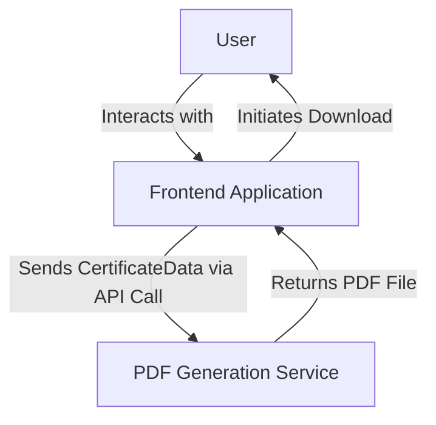

# Components

For V1.0, our system is comprised of two primary components.

### 1\. Frontend Application

  * **Responsibility:** To render the user interface, manage user input for the name and location, display the live certificate preview, and orchestrate the call to the PDF generation service.
  * **Key Interfaces:**
      * Exposes a web interface to the end-user.
      * Consumes the `POST /api/generate-pdf` endpoint from the PDF Generation Service.
  * **Dependencies:** Depends on the PDF Generation Service to fulfill the download request.
  * **Technology Stack:** Next.js, React, TypeScript, Tailwind CSS, shadcn/ui.

### 2\. PDF Generation Service

  * **Responsibility:** A stateless backend service that accepts `CertificateData` (`fullName` and `location`) and returns a high-resolution, personalized PDF file.
  * **Key Interfaces:**
      * Exposes the `POST /api/generate-pdf` endpoint as defined in the API Specification.
  * **Dependencies:** None on other internal components for V1.0.
  * **Technology Stack:** Next.js API Route (Node.js runtime), TypeScript.

### Component Interaction Diagram

-----
