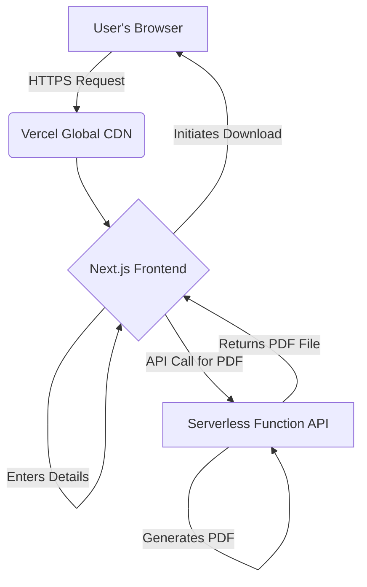

# High Level Architecture

### Technical Summary

The architecture for this project will follow a modern Jamstack approach, prioritizing performance, scalability, and cost-effectiveness. The system consists of a frontend application built with Next.js, which will be served statically via a global CDN. All backend logic, specifically the PDF generation, will be handled by an on-demand, serverless function. The entire project will be organized in a monorepo to streamline development and prepare for the backend services required in V2.0. This architecture directly supports the V1.0 goal of providing a fast, reliable, and globally accessible certificate generation experience.

### Platform and Infrastructure Choice

  * **Platform:** **Vercel**.
  * **Rationale:** As the creators of Next.js, Vercel provides a seamless, zero-configuration deployment and hosting platform. It automatically handles the build process, deployment of the serverless function, and serving of the frontend via its global edge CDN. This is the most pragmatic and efficient choice for this project.
  * **Key Services:**
      * Vercel Next.js Hosting
      * Vercel Serverless Functions
      * Vercel Global CDN

### Repository Structure

  * **Structure:** **Monorepo**.
  * **Rationale:** This structure was established in the PRD's technical assumptions. It allows us to manage the V1 frontend and serverless function in a single repository, and will easily accommodate the additional backend services for V2.0.

### High Level Architecture Diagram

### Architectural Patterns

  * **Jamstack Architecture:** We will use a modern JavaScript framework (Next.js) with backend logic provided by serverless functions.
      * *Rationale:* This pattern provides exceptional performance, high security, and low operational overhead.
  * **Component-Based UI:** The frontend will be built as a collection of reusable components.
      * *Rationale:* This is a standard practice for modern frameworks like Next.js and ensures a maintainable and scalable user interface.
  * **Serverless Functions:** All backend logic will be encapsulated in on-demand functions.
      * *Rationale:* This is highly cost-effective and automatically scales to meet the sharp, temporary increase in traffic expected after the event.

-----
